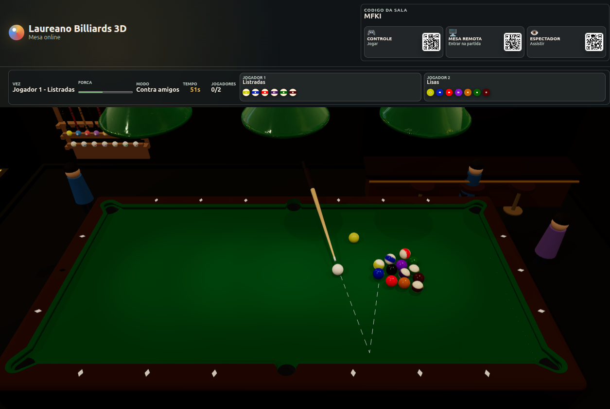
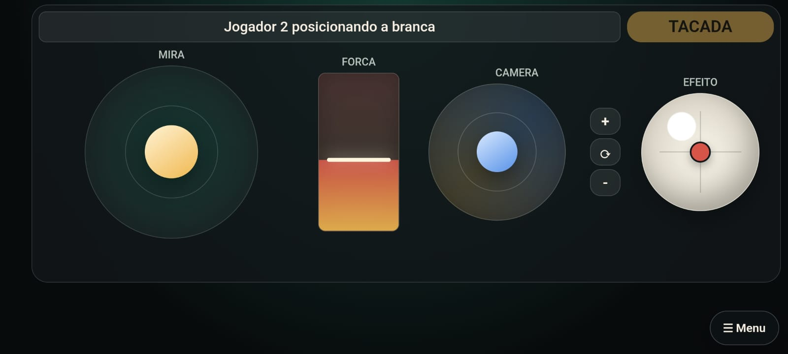

# 🎱 Laureano Billiards

Um salão de sinuca 3D totalmente interativo desenvolvido em **Three.js**, com foco em realismo, multiplayer local e arquitetura extensível para novos jogos.



---

## ✨ Funcionalidades

- 🎱 Salão de sinuca 3D
- 📱 Controles via celular
- 👥 Multiplayer
- ⚡ Renderização otimizada
- 🌙 Ambiente estilo pub/bar

---

## 🚀 Tecnologias

- Three.js
- Cannon-es.js
- JavaScript
- HTML5
- CSS3
- WebSockets
- Node.js

---

## 📁 Estrutura

```
.
├── assets/
│   ├── textures/
│   ├── models/
│   └── sounds/
│
├── js/
│   ├── editor.js
│   ├── objects.js
│   ├── lights.js
│   ├── controls.js
│   ├── physics.js
│   └── game.js
│
├── server.js
├── index.html
└── README.md
```

---

## ▶️ Executando

Instale as dependências

```bash
npm install
```

Execute

```bash
npm start
```

Abra

```
http://localhost:3100
```

---

## 🎮 Controles

### Desktop

| Tecla | Ação |
|-------|------|
| WASD | Movimentação |
| Mouse | Câmera |
| Clique | Interação |

### Mobile

- Analógico virtual
- Botões de ação
- Interface otimizada para touchscreen



---

## 🏗️ Editor

O projeto possui um editor integrado para criação do ambiente.

É possível:

- mover objetos
- rotacionar
- duplicar
- remover
- adicionar novos elementos
- salvar layouts

---

## 💡 Iluminação

O ambiente utiliza múltiplas fontes de luz:

- Hemisphere Light
- Point Lights
- Ambient Lighting
- Luz quente estilo pub

---

## 🎨 Objetos

Atualmente o mapa possui:

- Mesas de sinuca
- Rack de tacos
- Prateleiras de troféus
- Quadros
- Bar
- Bancadas
- Decoração
- Piso de madeira
- Paredes detalhadas

---

## ⚙️ Performance

O projeto foi pensado para manter boa performance:

- reutilização de geometrias
- materiais compartilhados
- poucas luzes dinâmicas
- renderização otimizada
- baixo consumo de memória

---


## 📌 Roadmap

- [X] Física das bolas
- [X] Sons ambientes
- [X] IA para partidas
- [ ] Chat multiplayer
- [ ] Sistema de ranking
- [ ] Personalização de tacos
- [ ] Torneios online

---

## 👨‍💻 Autor

**Adriano Laureano**

GitHub

https://github.com/sl4ureano

---

## 📄 Licença

MIT